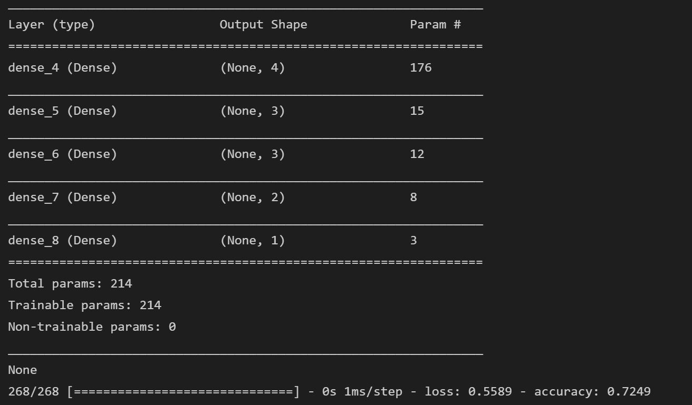
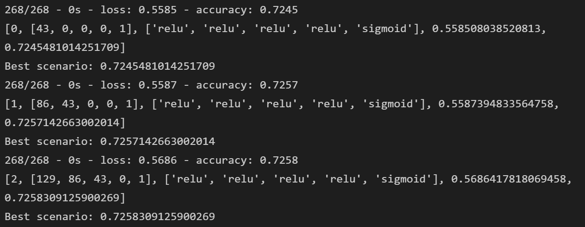

# Neural_Network_Charity_Analysis

## Objective

- Create a binary classifier that is capable of predicting whether applicants will be successful if funded by Alphabet Soup

## Results

- A database of more than 34,000 organizations that have received funding from Alphabet Soup was analyzed.

### Questions

#### Data Preprocessing

- What variable(s) are considered the target(s) for your model?
  - **IS_SUCCESSFUL**
- What variable(s) are considered to be the features for your model?
  - APPLICATION_TYPE            
  - AFFILIATION                 
  - CLASSIFICATION              
  - USE_CASE                    
  - ORGANIZATION                
  - STATUS                      
  - INCOME_AMT                  
  - SPECIAL_CONSIDERATIONS      
  - ASK_AMT                   
- What variable(s) are neither targets nor features, and should be removed from the input data?
  - EIN and NAME were eliminated as the first is an unique id and the second is the name.

#### Compiling, Training, and Evaluating the Model

- How many neurons, layers, and activation functions did you select for your neural network model, and why?
  - In a first attempt, using loops, more than 400 scenarios were created and evaluated iterating trough:
    - 1 to 4 hidden layers
    - 1 to 8 neurons for each layer
    - changing activation functions for hidden layers between: relu, sigmoid and tanh
  - The best neural network detected in all iterations was the model **156** (all models were trained with 20 epochs)
    - Model: 156
    - Nodes: [4, 3, 3, 2, 1]
    - Activation Functions: ['relu', 'relu', 'relu', 'relu', 'sigmoid']
    - loss: 0.5583194494247437
    - Accuracy: 0.7276967763900757
- Were you able to achieve the target model performance? / What steps did you take to try and increase model performance?
  - No, adding more neurons didn’t improved the performance
  - After 100 epochs the model didn't improve:
    - 
  - Other models were tried using 100 epochs to train them but the accuracy didn't improved
    - 

## Summary

- After reviewing more than 370 Neural Networks configurations, the most simple and efficient model had 5 layers with the following nodes: [4, 3, 3, 2, 1]
- Increasing epochs, layers or neurons didn't increased the accuracy.
- Another model as a logistic regression could have a better result as it sometimes is better for a binomial categorization.
